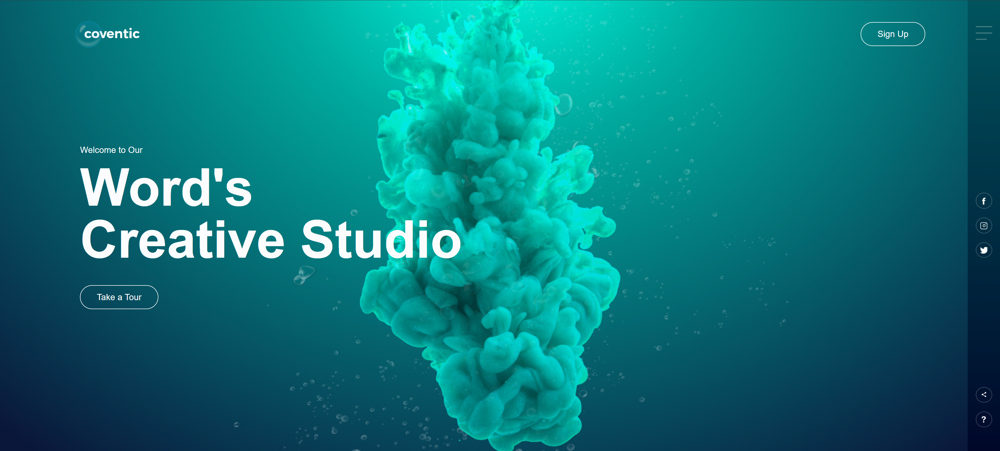

# 🌐 Creative Studio Landing Page  

This project is a **modern and interactive landing page** designed for a creative studio.  
It combines simplicity, minimalism, and engaging visuals to showcase services, portfolio, and brand identity.  

---

## 🚀 Features  
- **About Section** introducing the studio in a clear, minimal style  
- **Services Section** with interactive cards for branding, UI/UX, development, and strategy  
- **Portfolio Showcase** with a clean grid/carousel of recent projects  
- **Call to Action (CTA)** to encourage new projects and collaborations  
- **Minimal Footer** with quick links and social media icons  

---

## 🎨 Tech & Design Notes  
- Clean **HTML5 / CSS3 / JavaScript** structure  
- Responsive layout for all screen sizes  
- Smooth animations and microinteractions for a modern feel  
- Minimalist UI with strong typography and visual focus  

---

## 📂 Project Structure  

